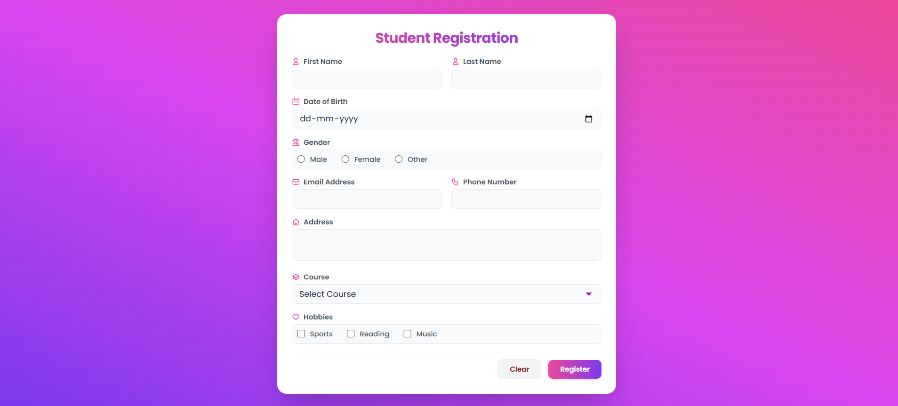
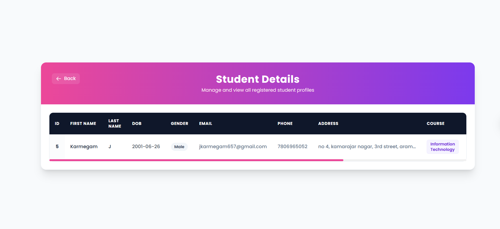
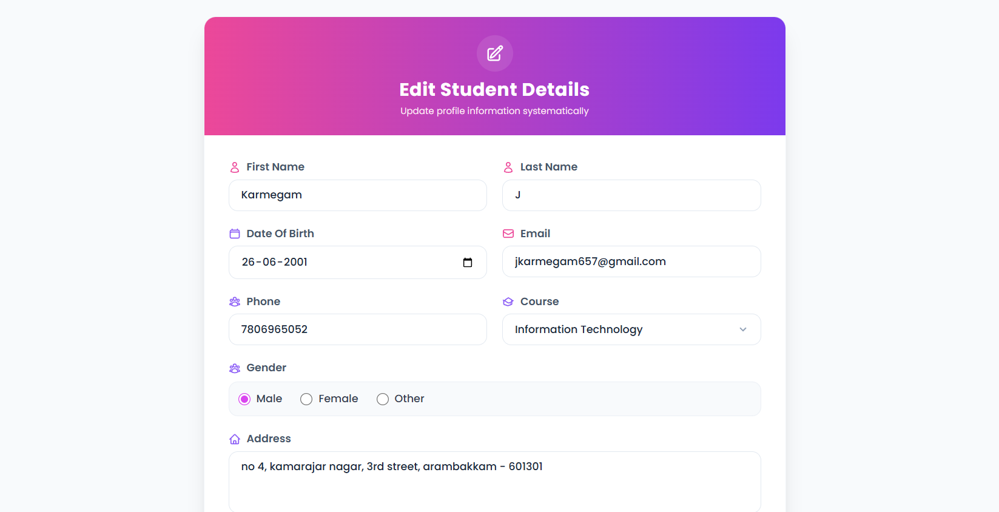

# 🎓 Student Management System


[](https://5.imimg.com/data5/SELLER/Default/2023/10/355416189/DM/UD/MI/3497104/responder-student-reporting-management-system.png](https://www.sarvika.com/wp-content/uploads/2022/02/Student-Management-System.png)

## 📖 Project Overview

The Student Management System is a web-based application developed using **Python**, **Flask**, and **Supabase PostgreSQL**. It enables efficient management of student records through a simple and user-friendly interface.

The application supports complete **CRUD (Create, Read, Update, Delete)** operations, allowing users to add, view, update, and delete student information. The project demonstrates backend development, database integration, and web application development skills.

---

## 🚀 Features

* ➕ Add Student Records
* 👀 View Student Details
* ✏️ Update Student Information
* ❌ Delete Student Records
* 🗄️ Supabase PostgreSQL Database Integration
* 🌐 Responsive Web Interface

---

## 🛠️ Tech Stack

* Python
* Flask
* Supabase PostgreSQL
* HTML5
* CSS3
* SQL

---

## 📸 Application Screenshots

### Home Page


### Student Registration



### View Students



### Edit Student Details



---

## 📂 Project Structure

```text
Student-Management-System/
│
├── app.py
├── requirements.txt
├── vercel.json
│
├── templates/
│   ├── index.html
│   ├── studentregister.html
│   ├── viewstudent.html
│   └── editstudent.html
│
├── static/
│   ├── css/
│   └── images/
│
└── README.md
```

---

## ⚙️ Installation

1. Clone the repository

```bash
git clone https://github.com/your-username/Student-Management-System.git
```

2. Navigate to the project folder

```bash
cd Student-Management-System
```

3. Install dependencies

```bash
pip install -r requirements.txt
```

4. Configure Supabase PostgreSQL environment variables

```env
DB_HOST=your_host
DB_NAME=postgres
DB_USER=postgres
DB_PASSWORD=your_password
DB_PORT=5432
```

5. Run the application

```bash
python app.py
```

---

## 🎯 Learning Outcomes

* Flask Web Development
* PostgreSQL Database Connectivity
* CRUD Operations
* Backend Development
* Environment Variable Configuration
* Deployment and Version Control

---

## 👨‍💻 Author

**Karmegam J**

Passionate UX/UI Designer and Python Developer focused on building user-friendly and data-driven applications.
